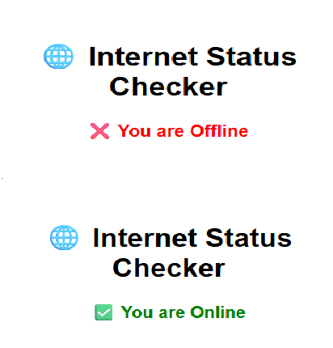

# 🌐 Internet Status Checker

A lightweight web app that checks and displays your current internet connection status in real-time using JavaScript's `navigator.onLine`.

---

## 📸 Preview

---

## 🚀 Features

- Detects if user is online or offline
- Updates status instantly on network change
- Works fully offline (for testing “Offline” state)
- Responsive, minimal design

---

## 🧠 How It Works

- Uses:
  javascript
  navigator.onLine

Listens for:

window.addEventListener("online", ...)

window.addEventListener("offline", ...)

Dynamically updates message and color

---

🛠 Tech Stack

✅ HTML5 – Structure

✅ CSS3 – Styling

✅ JavaScript – Connectivity logic

---

📁 Folder Structure

internet-status-checker/
├── index.html
├── style.css
├── script.js
├── internet-status-preview.png
└── README.md

---

💡 Bonus Ideas

Add offline/online icons or animations

Send alerts/notifications when offline

Use background service to track uptime

---

🧑‍💻 Author

Built with 🧠 by Santhiya Baskar

---

📃 License

This project is free to use and open-source under the MIT License.